# Material Rendering implemented with OpenGL
This is a simple CG project for practicing, including 6 sample materials rendered under D65 illumination.

### White Chalk

The material should have a rough feeling, so "NormalMap" texture and bump mapping effect is used. The shape is adjusted to be finer and the color is set similar to real white chalk.

As the reflection of chalk should not include specular reflection, the fragment color is computed as:

where  is object color,  is light color,  is diffuse reflectivity,  is the normal vector at a point,  is vector of light direction and  is ambient light.

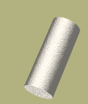&nbsp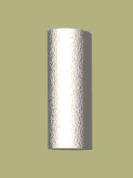&nbsp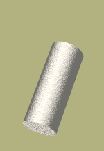

### Brick

This example used color with RGB of `(50, 209, 146)`. To make the object similar to brick, set the specular reflection color close to turquoise, and apply "BrickNormalMap" texture. The bump mapping effect is strengthened. Let  be the vector of view direction, , according to Phong reflection model, the fragment color is computed as:

where  is specular reflectivity and  is related to shininess value of the highlight.

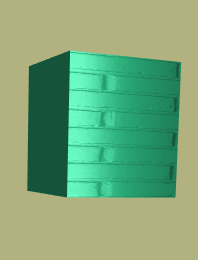&nbsp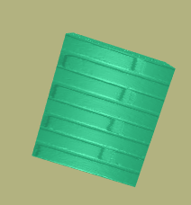&nbsp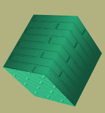

### Copper Metallic Coin

For copper metalic material, the RGB of copper color is used and the specular reflection color is set proportional to the incident light color. Compute fragment color in the same way as .

&nbsp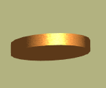&nbsp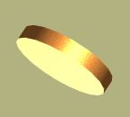

### Obsidian

To make the surface close to the unevenness of the rock, "circles" texture is used and the bump mapping effect is strengthened. The object color, specular reflection color and ambient light color is used from [OpenGL/VRML Materials](http://devernay.free.fr/cours/opengl/materials.html). Compute fragment color in the same way as .

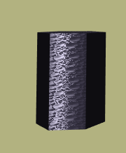&nbsp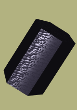&nbsp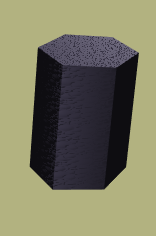

### Red Plastic

The specular reflection color is set equal to the incident light color, and ambient light is set to 0.

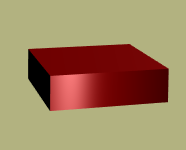&nbsp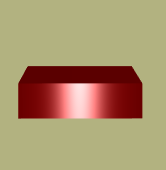&nbsp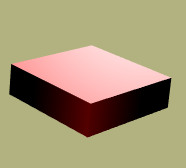

### Pearl

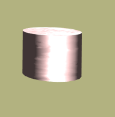&nbsp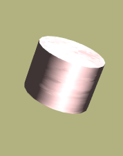&nbsp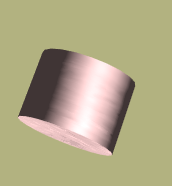

